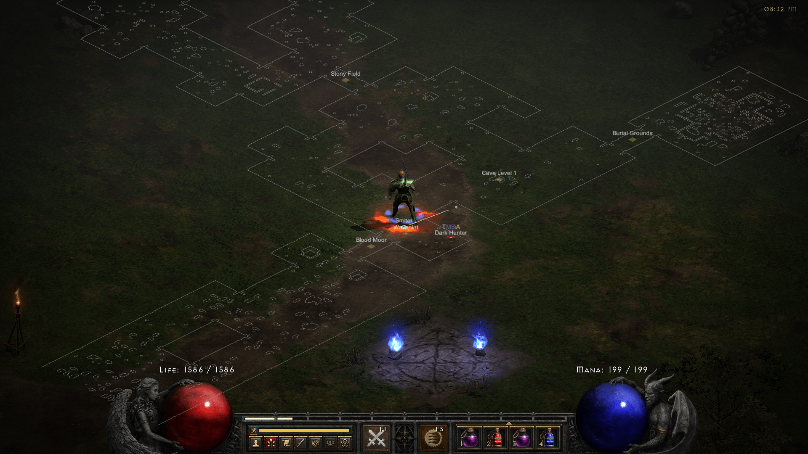

**README in other languages: [中文说明](contrib/zhCN/README.md)**

# D2RMH
Diablo II Resurrected map revealing tool.

# Disclaimer
**D2RMH is only reading process memory from D2R, without injects, hooks or memory writes,  
but I do not guarentee that it is totally ban-free, use at your own risk.**

# What's New
Check [ChangeLog](doc/ChangeLog.md)

# Prerequisite
* Diablo II 1.12, 1.13c or 1.13d is required. You can get a minimal subset of v1.13c files [HERE](https://archive.org/details/diablo-ii-1.13c-minimal.-7z)

# Usage
0. Virus/Malware detection WARNING:
   * If you are using Windows Defender, disable it or add D2RMH to whitelist to avoid misreporting of malware.
   * D2RMH can pass most Anti-Virus software detections, but not all of them, you can compile it your self if worry about it, check `How to build` section below
1. Download from `Releases` section, or any snapshot packs from `Actions` section(You need to log-in to GitHub). 
2. Edit D2RMH.ini, set `d2_path` to path of your Diablo II folder,
   or just put extracted `D2RMH.exe` and all `.ini` files to D2 v1.13c folder.
3. Run D2RMH.exe, enjoy!

# Screenshots

# Plugin system
* Plugins are `.lua` scripts loaded from `plugins` folder
* Read [document](doc/Plugin.md) if you want to write your own plugin

# TODO
Check [TODO](doc/TODO.md)

# How to build
## Quick instruction
* Install [cmake](https://www.cmake.org/) and add `cmake\bin` to your `PATH` environment variable so that you can type `cmake` in command line to call it directly
* Run `build_msvc2019.bat`, `build_msvc2022.bat`, `build_msys2_clang.bat` or `build_msys2_mingw.bat` to build.  
  Note: You should have certain compilers intalled. For msys2 builds, install required packages as instructions below.
## Detailed instruction without .bat scripts 
### MinGW GCC
* Install MSYS2(https://www.msys2.org), type `pacman -Syu --noconfirm && pacman -S --noconfirm --needed make git mingw-w64-i686-toolchain mingw-w64-i686-cmake mingw-w64-ucrt-x86_64-toolchain mingw-w64-ucrt-x86_64-cmake` in MSYS2 command line to install required components
* Build D2RMH(64bit):
  * Open new Shell using ucrt64.exe
  * Clone D2RMH source by type `git clone https://github.com/soarqin/D2RMH`
  * Type `cd D2RMH && cmake -Bbuild -G "Unix Makefiles" -DCMAKE_BUILD_TYPE=Release -DUSE_STATIC_CRT=ON`
  * Then `make -Cbuild D2RMH` to get the compiled binary in `build/bin` folder
* Build d2mapapi-piped(32bit):
  * Open new Shell using mingw32.exe
  * Change current directory to D2RMH source
  * Type `cmake -Bbuild_d2mapapi -G "Unix Makefiles" -DCMAKE_BUILD_TYPE=Release -DUSE_STATIC_CRT=ON d2mapapi`
  * Then `make -Cbuild_d2mapapi d2mapapi-piped` to get the compiled binary in `build_d2mapapi/bin` folder
### MSYS2 Clang
* Mostly same as MinGW GCC, with following changes:
  * `mingw-w64-i686-toolchain`->`mingw-w64-clang-i686-toolchain`
  * `mingw-w64-i686-cmake`->`mingw-w64-clang-i686-cmake`
  * `mingw-w64-ucrt-x86_64-toolchain`->`mingw-w64-clang-x86_64-toolchain`
  * `mingw-w64-ucrt-x86_64-cmake`->`mingw-w64-clang-x86_64-cmake`
  * `ucrt64.exe`->`clang64.exe`
  * `mingw32.exe`->`clang32.exe`
### Microsoft Visual Studio 2019/2022
* Install Visual Studio 2019 or 2022 Community Edition(or Pro/Ent if you have)
* Unpack downloaded source code file, or you can use git to Clone D2RMH source by type: `git clone https://github.com/soarqin/D2RMH`. Note: Using git requires [Git for windows](https://git-scm.com/download/win) installed
* Build D2RMH(64bit):
  * (Visual Studio 2019) Type `cmake -Bbuild -G "Visual Studio 16 2019" -A x64 -DUSE_STATIC_CRT=ON`  
    (Visual Studio 2022) Type `cmake -Bbuild -G "Visual Studio 17 2022" -A x64 -DUSE_STATIC_CRT=ON`
  * Now you can either:
    * Type `cmake --build build --config Release --target D2RMH`
    * Open generated `build\D2RMH.sln` and build `D2RMH` target
  * Compiled binaries are located in `build\bin` folder
* Build d2mapapi-piped(32bit):
  * (Visual Studio 2019) Type `cmake -Bbuild_d2mapapi -G "Visual Studio 16 2019" -A Win32 -DUSE_STATIC_CRT=ON d2mapapi`  
    (Visual Studio 2022) Type `cmake -Bbuild_d2mapapi -G "Visual Studio 17 2022" -A Win32 -DUSE_STATIC_CRT=ON d2mapapi`
  * Now you can either:
    * Type `cmake --build build_d2mapapi --config Release --target d2mapapi_piped`
    * Open generated `build_d2mapapi\d2mapapi.sln` and build `d2mapapi_piped` target
  * Compiled binaries are located in `build_d2mapapi\bin` folder

# Credits
* [d2mapapi_mod](https://github.com/soarqin/d2mapapi_mod) modified from [d2mapapi](https://github.com/jcageman/d2mapapi).
* Idea and memory offsets from [MapAssist](https://github.com/misterokaygo/MapAssist).
* [Handmade Math](https://github.com/HandmadeMath/Handmade-Math) for matrix calculations.
* [glad](https://glad.dav1d.de) for loading OpenGL(Core)/WGL functions.
* [inih](https://github.com/benhoyt/inih) for reading INI files.
* [JSON for Modern C++](https://github.com/nlohmann/json) for processing JSON files.
* [CascLib](https://github.com/ladislav-zezula/CascLib) for reading Casc Storage from Diablo II Resurrected.
* [stb](https://github.com/nothings/stb), stb_truetype and stb_rect_pack are used.
